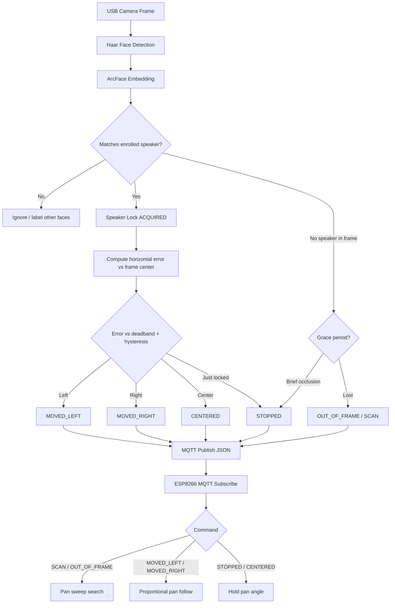

# BENAX Assessment — Face Locking Vision Control

**Team:** rusi123  
**Project:** AI-Powered Single-Speaker Face Recognition and Camera Tracking  
**Time allowed:** 6 hours  

---

## 1. System overview

| Layer | Component | Role |
|-------|-----------|------|
| Vision | PC + USB camera | Detect, enroll, recognize, track single speaker |
| Messaging | MQTT broker (port **1884**) | Publish motor commands Wi-Fi → ESP8266 |
| Edge | ESP8266 | Subscribe, drive horizontal pan servo |
| Evidence | `data/logs/evidence_*.csv` | Speaker ID, confidence, timestamp, motor command |
| Monitor | Dashboard `http://localhost:8080` | Live status + confidence |

---

## 2. Pipeline flowchart



---

## 3. BENAX motor commands

| Command | When published | ESP8266 action |
|---------|----------------|----------------|
| `SCAN` | Searching, no speaker in frame | Pan sweep left ↔ right |
| `OUT_OF_FRAME` | Speaker lost after grace period | Pan sweep |
| `MOVED_LEFT` | Face center left of deadband | Pan left (proportional) |
| `MOVED_RIGHT` | Face center right of deadband | Pan right (proportional) |
| `CENTERED` | Face within deadband | Hold position |
| `STOPPED` | Lock acquired or brief occlusion | Hold position |

**Note:** Vertical tracking is **not** motorised. The supplied **2-DOF mount** uses **manual tilt**; only **horizontal pan** is servo-actuated (BENAX spec).

---

## 4. Wiring and pin diagram

### ESP8266 (NodeMCU / Wemos D1 Mini) → Servo

```
                    ┌─────────────────────┐
                    │     ESP8266         │
                    │                     │
   Servo SIGNAL ────┤ D7 (GPIO13)         │  ← Pan servo signal (3.3V logic OK)
                    │                     │
   Servo V+    ─────┤ VIN (5V) or ext 5V │  ← Use 5V for torque (not 3.3V)
   Servo GND   ─────┤ GND                 │  ← Common ground with servo
                    │                     │
                    │  USB / Micro-USB    │  ← Power + programming
                    └─────────────────────┘
                              │
                         Wi-Fi 2.4 GHz
                              │
                    ┌─────────▼───────────┐
                    │  PC MQTT Broker     │
                    │  0.0.0.0:1884       │
                    └─────────────────────┘
```

| Wire | From | To | Notes |
|------|------|-----|-------|
| Signal (orange/yellow) | Servo | **D7 / GPIO13** | Spec example uses D5/GPIO14; this build uses **D7** (verified on board) |
| V+ (red) | 5V supply or ESP **VIN** | Servo V+ | 4.8–6V recommended; weak motion if only 3.3V |
| GND (brown/black) | ESP **GND** | Servo GND | Must share ground |

### Power architecture

- **ESP8266:** USB 5V via micro-USB (logic + Wi-Fi).
- **Servo:** Prefer **external 5V** (≥1A) for V+; tie GND to ESP8266 GND.
- **PC:** USB camera + Python vision node + MQTT broker.

### Safety

- Do not stall servo against mechanical hard stops (`PAN_MIN=15`, `PAN_MAX=165` in firmware).
- Disconnect servo power before wiring changes.
- Keep USB cables away from pan range.

---

## 5. Software stack

| Requirement | Implementation |
|-------------|----------------|
| Python 3.10+ | Vision, enrollment, MQTT publish |
| OpenCV | Capture, visualize, track |
| ArcFace ONNX | Embeddings / identity match |
| paho-mqtt | PC MQTT client |
| MQTT broker | Aedes Node.js (`npm run broker`) or Mosquitto |
| NumPy | Embeddings, math |
| CSV / JSON logs | `src/evidence_logger.py` → `data/logs/` |

---

## 6. Validation test checklist

Run with vision node + broker + ESP8266 on **same Wi-Fi**. Submit resulting `data/logs/evidence_*.csv`.

| # | Test | Steps | Pass criteria |
|---|------|-------|---------------|
| 1 | **Enrollment** | `python -m src.enroll --name ruth --auto` | 10–30 samples; `data/db/face_db.npz` updated |
| 2 | **Single speaker lock** | Start vision node; only ruth in frame | Green box, confidence on camera, `STOPPED`/`CENTERED`, `locked: true` |
| 3 | **Ignore other faces** | Second person in frame | Other faces labeled; motor follows **ruth** only |
| 4 | **Move left** | Ruth walks to left side of frame | MQTT `MOVED_LEFT`; pan follows |
| 5 | **Move right** | Ruth walks to right | MQTT `MOVED_RIGHT`; pan follows |
| 6 | **Centered** | Ruth in center | `CENTERED`; servo holds |
| 7 | **Brief occlusion** | Cover face < 1 s | `STOPPED`; **no** search sweep |
| 8 | **Out of frame** | Leave camera view | `OUT_OF_FRAME` / `SCAN`; servo sweeps |
| 9 | **Re-acquisition** | Re-enter frame | Lock again; sweep stops (`STOPPED`) |
| 10 | **Evidence log** | Run tests 2–9 | CSV has speaker_id, confidence, timestamp, motor_command |
| 11 | **ESP8266 link** | Serial Monitor 115200 | `WiFi connected`, `MQTT ... Connected!` |
| 12 | **Dashboard** | Open `http://localhost:8080` | Live command + confidence |

---

## 7. Quick start (demo)

```powershell
# Terminal 1 — MQTT broker
cd backend
npm run broker

# Terminal 2 — Dashboard
cd backend
npm start

# Terminal 3 — Vision node
python src\vision_node.py --broker 127.0.0.1 --pick --camera 1
```

1. Set `mqtt_server` in `esp8266/vision_servo/vision_servo.ino` to PC Wi-Fi IP (`ipconfig`).
2. Upload sketch to ESP8266.
3. Confirm Serial: `WiFi connected` → `MQTT ... Connected!`

---

## 8. Notes to assessors

- **Team ID / MQTT topic:** `vision/rusi123/movement`
- **Broker port:** 1884 (Aedes embedded broker; equivalent to Mosquitto for assessment)
- **Enrolled speaker:** `ruth` (single identity in `face_db.npz`)
- **Camera index:** External USB camera = **1**
- **Servo pin:** D7 (GPIO13), not D5 — chosen to avoid compile/upload conflicts on this NodeMCU board
- **2-DOF:** Horizontal = servo; vertical tilt = **manual** on mechanical mount
- **Smoothing:** Deadband (7%) + hysteresis (3%) + 4-frame command hold before MQTT publish change
- **Materials used:** FalconEye / USB camera, ESP8266, servo, 2-DOF mount, jumper wires, USB hub as provided

---

## 9. Evidence file format

**CSV columns:** `timestamp`, `speaker_id`, `confidence`, `motor_command`, `locked`

Example:

```csv
timestamp,speaker_id,confidence,motor_command,locked
2026-06-12T19:30:01,ruth,0.5823,STOPPED,True
2026-06-12T19:30:02,ruth,0.6011,CENTERED,True
2026-06-12T19:30:05,ruth,0.5944,MOVED_LEFT,True
```

Mirror JSON written alongside: `data/logs/evidence_YYYYMMDD_HHMMSS.json`
